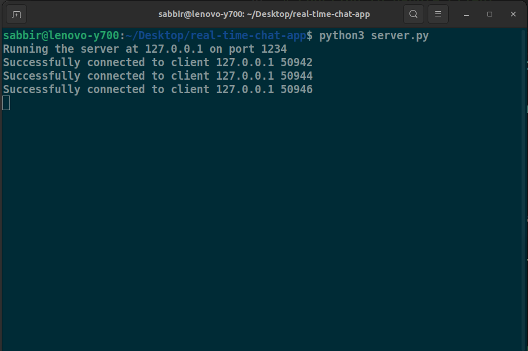
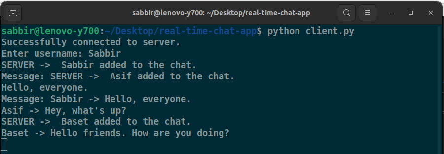
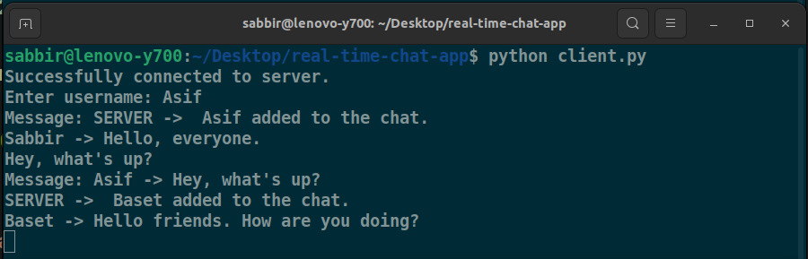
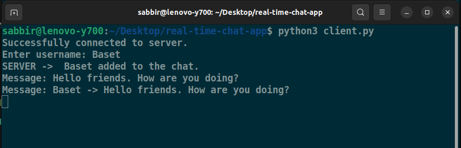

# real-time-chat-app

- This repository contains code for a real-time chat application. The server can handle maximum 5 active clients at a time.
- Running the `server.py` file starts a server in the localhost on port 1234.
  
- For working with the files at first run the `server.py` file and then the `client.py` file in a separate terminal. To add more client, open another terminal and run the `client.py` file. Provide the username as the terminal/command window asks for.
  
  
  
